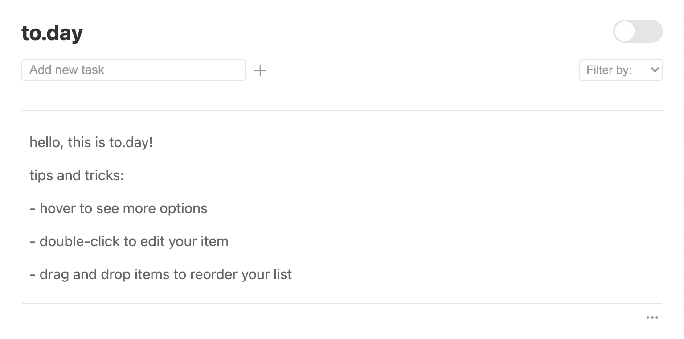
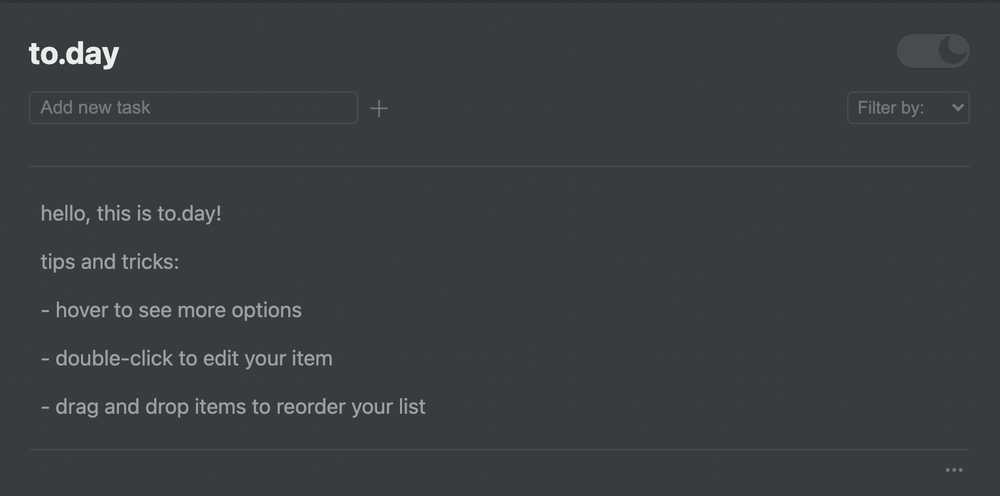

## to.day - daily task manager

#### Designed and built by Carolyn Lau

To.day allows the user to manage their daily tasks in a clean manner. As a create-read-update-delete (CRUD) app, users are able to:

1. Add tasks using the input field.
2. Reorder item positions via drag and drop.
3. View items by completion status with the 'Filter by:' menu.
4. Edit tasks by double-clicking each item.
5. Mark as complete or delete tasks by selecting the respective icon on the item's hover state.
6. Toggle between light and dark mode using the sliding togggle switch.
7. Access more actions via the options menu (indicated by a horizontal ellipsis `...`).

All tasks are saved to local storage.

#### Screenshots

### Built with

- SCSS
- React JS Library [[React]](https://reactjs.org/)
- Bootstrapped with [[Create React App]](https://github.com/facebook/create-react-app)
- Drag and drop functionality [[react-beautiful-dnd]](https://github.com/atlassian/react-beautiful-dnd)

### Set-up

1. Clone this repository to your desktop. [[https://github.com/the-cl/room.git]](https://github.com/the-cl/room.git)
2. From your device's terminal, `cd` into the project directory.
3. Run `npm start` to open the app in the development mode and view it in your browser. [[localhost:3000]](http://localhost:3000)
4. Run `npm run build` to create your optimized production build.

### Project Goals and Challenges

Aside from the foundational CRUD functions, I wanted the ability to reorder items by drag and drop functionality, and to have task items to persist even on page refresh. I accomplished these goals by integrating the `react-beautiful-dnd` library and the `localStorage` property respectively.

To efficiently render multiples of the same component, and to manage the rendered UI based on state, the React library was the tool of choice. As a first time React user, learning the `useState` and `useEffect` hooks were the biggest challenges, but proved integral to managing my rendered components based on state.

### Continued development

I will continue to improve on best practices for organizing my code and components, specifically separating the presentational and logical components.

Some additional features to expand the project include:

- adding custom tags/categories
- allowing users to pin/star important items to the top
- searching for tasks that include the user query

### Acknowledgements

Design inspired by [[Notion.so]](notion.so).
